# Alaska Snow Department Agent - Architecture

## System Architecture

```mermaid
graph TB
    User[👤 User] -->|Question| UI[🖥️ Streamlit UI<br/>Cloud Run]
    UI -->|HTTP Request| Agent[🤖 Alaska Snow Agent]
    
    Agent -->|1. Validate Input| MA1[🛡️ Model Armor<br/>Input Validation]
    MA1 -->|Sanitized Query| RAG[📚 RAG Pipeline]
    MA1 -->|Sanitized Query| Weather[🌤️ Weather API]
    
    RAG -->|Search| BQ[(BigQuery<br/>Vector Search<br/>50 FAQs + Embeddings)]
    BQ -->|Top-3 Similar FAQs| RAG
    
    Weather -->|GET /alerts| NWS[National Weather<br/>Service API]
    NWS -->|Alerts & Forecast| Weather
    
    RAG -->|FAQ Context| Gemini[✨ Gemini 2.5 Pro]
    Weather -->|Weather Data| Gemini
    
    Gemini -->|Generated Answer| MA2[🛡️ Model Armor<br/>Output Validation]
    MA2 -->|Validated Response| Agent
    
    Agent -->|Log Event| CL[☁️ Cloud Logging]
    Agent -->|Response| UI
    UI -->|Display Answer| User
    
    style User fill:#e3f2fd
    style UI fill:#bbdefb
    style Agent fill:#90caf9
    style MA1 fill:#ffccbc
    style MA2 fill:#ffccbc
    style RAG fill:#c5e1a5
    style BQ fill:#aed581
    style Weather fill:#fff9c4
    style NWS fill:#fff59d
    style Gemini fill:#ce93d8
    style CL fill:#b0bec5
```

## Data Flow

## Component Details

### Security Layer (Model Armor)
- **Input**: Validates all user queries for prompt injection/jailbreak
- **Output**: Validates all model responses for policy compliance
- **Template**: `alaska-snow-guard` with LOW_AND_ABOVE confidence

### RAG Pipeline (BigQuery)
- **Storage**: 50 FAQ entries (1 CSV + 50 TXT files)
- **Embeddings**: 768-dimensional vectors via `text-embedding-005`
- **Search**: VECTOR_SEARCH with `fraction_lists_to_search: 0.01`
- **Retrieval**: Top-3 most similar FAQs

### Weather Integration (NWS)
- **API**: api.weather.gov (no authentication required)
- **Endpoints**: `/alerts/active?area=AK`, `/points/{lat},{lon}/forecast`
- **Caching**: 5-minute TTL to reduce API calls
- **Data**: Real-time alerts and 7-period forecast

### Answer Generation (Gemini 2.5 Pro)
- **Model**: gemini-2.5-pro
- **Temperature**: 0.2 (factual responses)
- **Context**: FAQ context + weather data + user query
- **System Instruction**: ADS-specific guidelines

### Logging (Cloud Logging)
- **Events**: query_received, answer_generated, errors
- **Data**: query, answer, processing_time, RAG/weather usage, security status
- **Location**: Cloud Logging in project qwiklabs-gcp-01-752385122246

## Deployment

## Technologies

| Component | Technology | Purpose |
|-----------|-----------|---------|
| **Frontend** | Streamlit | Web UI |
| **Backend** | FastAPI (optional) | REST API |
| **AI Model** | Gemini 2.5 Pro | Answer generation |
| **Embeddings** | text-embedding-005 | Vector representations |
| **Data Store** | BigQuery | FAQ storage + vector search |
| **Security** | Model Armor | Input/output validation |
| **Weather** | NWS API | Real-time weather data |
| **Logging** | Cloud Logging | Monitoring & audit trail |
| **Deployment** | Cloud Run | Serverless hosting |
| **Container** | Docker | Application packaging |

## Key Features

- ✅ **Secure**: Model Armor validates all inputs and outputs
- ✅ **Accurate**: RAG retrieves relevant FAQ context
- ✅ **Current**: Real-time weather alerts and forecasts
- ✅ **Scalable**: Cloud Run auto-scales 0-10 instances
- ✅ **Observable**: All interactions logged to Cloud Logging
- ✅ **Tested**: 18 tests (15 unit + 3 evaluation API)
- ✅ **Production-Ready**: Deployed and publicly accessible

