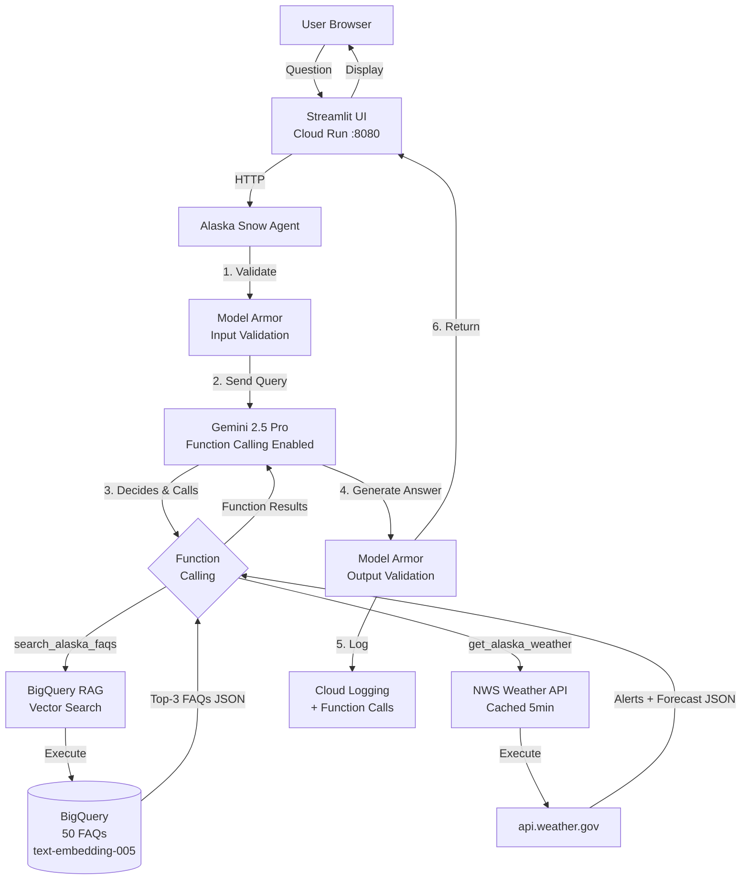
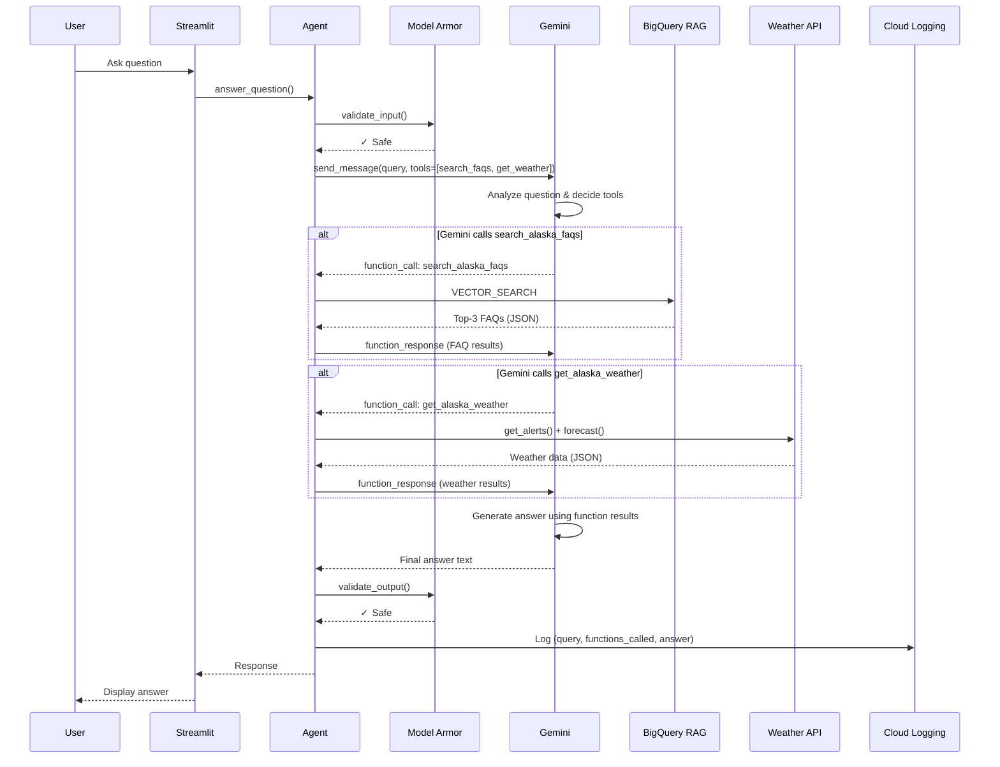

# Alaska Department of Snow AI Agent

Production-ready AI chatbot for the Alaska Department of Snow, helping 750,000 citizens across 650,000 square miles with snow-related inquiries.

## Architecture

### System Overview



### Request Flow



## Key Features

### 🤖 Function Calling
- Gemini intelligently decides which tools to use
- `search_alaska_faqs`: Searches FAQ database
- `get_alaska_weather`: Fetches weather data
- Parallel function execution when needed

### 🔒 Security
- Model Armor input/output validation
- Validates before and after function calls

### 🔍 RAG
- BigQuery vector search with text-embedding-005
- 50 FAQ entries from CSV + TXT files

### 🌤️ Weather
- National Weather Service API
- Real-time alerts and forecasts

### 📊 Logging
- Cloud Logging tracks all interactions and function calls

## Prerequisites

- **GCP Account** with access to project `qwiklabs-gcp-01-752385122246`
- **gcloud CLI** installed ([install guide](https://cloud.google.com/sdk/docs/install))
- **Python 3.11+**
- **Required APIs enabled**: Vertex AI, BigQuery, Model Armor, Cloud Logging

## Quick Start (Local Development)

### Option 1: Automated Setup

```bash
cd challenge_five
./setup.sh
```

This script will:
- Authenticate with GCP
- Enable required APIs
- Create Python virtual environment
- Install all dependencies

### Option 2: Manual Setup

```bash
# 1. Authenticate with GCP
gcloud auth application-default login
gcloud config set project qwiklabs-gcp-01-752385122246

# 2. Enable APIs
gcloud services enable aiplatform.googleapis.com bigquery.googleapis.com \
  logging.googleapis.com modelarmor.googleapis.com

# 3. Create virtual environment
python3 -m venv venv
source venv/bin/activate  # On Windows: venv\Scripts\activate

# 4. Install dependencies
pip install -r requirements.txt
```

## Data Setup

### 1. Create Model Armor Template (One-time)

```bash
# Activate virtual environment first
source venv/bin/activate

# Create Model Armor security template
python data/setup_model_armor.py
```

**Note**: If this fails, create the template manually in Cloud Console with ID `alaska-snow-guard`

### 2. Load ADS FAQ Data

```bash
# Run data loading script
python data/load_ads_data.py
```

This will:
- Load 1 CSV file + 50 TXT files from GCS
- Create BigQuery dataset `alaska_snow_dataset`
- Generate embeddings with `text-embedding-005`
- Create vector search index

**Note**: Follow the instructions printed by the script to grant permissions to the BigQuery connection service account.

## Running the Application

### Local Development

```bash
# Activate virtual environment
source venv/bin/activate

# Run Streamlit UI
streamlit run frontend/streamlit_app.py

# Or run FastAPI backend (optional)
python -m app.main
```

Access at: `http://localhost:8501` (Streamlit) or `http://localhost:8080` (FastAPI)

### Running in Colab

1. Upload the entire `challenge_five/` directory to Colab
2. Run in a notebook cell:
```python
!pip install -r requirements.txt
!python data/load_ads_data.py
!streamlit run frontend/streamlit_app.py &
```

## Testing

### Run All Tests
```bash
pytest tests/ -v

# 18 tests: 14 unit tests (mocked) + 4 integration tests (live)
```

### Unit Tests (Mocked - No GCP Required)
```bash
pytest tests/test_agent.py tests/test_rag.py tests/test_security.py tests/test_weather_api.py -v
```

### Integration Tests (Function Calling - Requires GCP)
```bash
pytest tests/test_agent_eval.py -v -s

# Verifies:
# - Gemini function calling works
# - RAG retrieval via search_alaska_faqs function
# - Weather API via get_alaska_weather function  
# - Security validation
```

### Model Armor Integration Tests (Live)
Run a pytest that issues three live queries (safe, blocked, out-of-domain) through Model Armor + Gemini.

```bash
pytest tests/integration/security_integration.py -v -s

# Requires:
# - Application Default Credentials with access to project qwiklabs-gcp-01-752385122246
# - Model Armor template alaska-snow-guard configured in us-central1
```

### With Coverage
```bash
pytest tests/ --cov=app --cov-report=html
```

## Evaluation

```bash
cd evaluation
python run_evaluation.py
```

Evaluates agent performance on 15 snow-related questions using BLEU and ROUGE metrics.

## Deployment to Cloud Run

### Build and Deploy

```bash
# Build Docker image and deploy
gcloud builds submit --config deployment/cloudbuild.yaml

# Or manually:
docker build -t gcr.io/qwiklabs-gcp-01-752385122246/alaska-snow-agent:latest .
docker push gcr.io/qwiklabs-gcp-01-752385122246/alaska-snow-agent:latest

gcloud run deploy alaska-snow-agent \
  --image gcr.io/qwiklabs-gcp-01-752385122246/alaska-snow-agent:latest \
  --region us-central1 \
  --platform managed \
  --allow-unauthenticated \
  --memory 2Gi
```

## Project Structure

```
challenge_five/
├── app/                    # Core application
│   ├── agent.py           # Main RAG agent logic
│   ├── rag.py             # BigQuery vector search
│   ├── security.py        # Model Armor integration
│   ├── weather_api.py     # NWS API client
│   ├── config.py          # Configuration
│   └── main.py            # FastAPI backend
├── frontend/
│   └── streamlit_app.py   # Web UI
├── tests/                 # Pytest test suite
├── evaluation/            # Evaluation scripts
├── data/                  # Data loading scripts
└── deployment/            # Cloud deployment configs
```

## Features

### 🔒 Security (Model Armor)
- Input validation for prompt injection
- Output filtering for policy compliance
- All queries validated before processing

### 🔍 RAG (Retrieval-Augmented Generation)
- BigQuery ML with `text-embedding-005`
- VECTOR_SEARCH for similarity matching
- Combines CSV (1 file) + TXT (50 files) data sources
- Top-3 FAQ retrieval

### 🌤️ Weather Integration
- National Weather Service API
- Real-time alerts for Alaska
- Forecast by coordinates
- 5-minute caching

### 📊 Logging & Monitoring
- Cloud Logging for all interactions
- Performance metrics
- Security event tracking

## Configuration

Edit `app/config.py` to customize:
- GCP project and region
- Model Armor template ID
- Gemini model and parameters
- Cache TTL
- System instructions

## Troubleshooting

### Authentication Errors
```bash
# Re-authenticate
gcloud auth application-default login
```

### BigQuery Permission Errors
```bash
# Grant BigQuery connection permissions (see output from load_ads_data.py)
gcloud projects add-iam-policy-binding qwiklabs-gcp-01-752385122246 \
  --member=serviceAccount:SERVICE_ACCOUNT_EMAIL \
  --role=roles/aiplatform.user
```

### Model Armor Errors
- Ensure Model Armor API is enabled
- Create template in Cloud Console if needed
- Template ID should be: `alaska-snow-guard`

## Cost Estimation

### Development/Testing
- BigQuery: ~$5/month
- Vertex AI: ~$10/month
- Model Armor: ~$5/month
- Cloud Run: Free tier
- **Total**: ~$20/month

### Production (1000 users/day)
- BigQuery: ~$20/month
- Vertex AI: ~$100/month
- Model Armor: ~$50/month
- Cloud Run: ~$30/month
- **Total**: ~$200/month

## Support

**Project**: qwiklabs-gcp-01-752385122246  
**Region**: us-central1  
**Dataset**: alaska_snow_dataset

